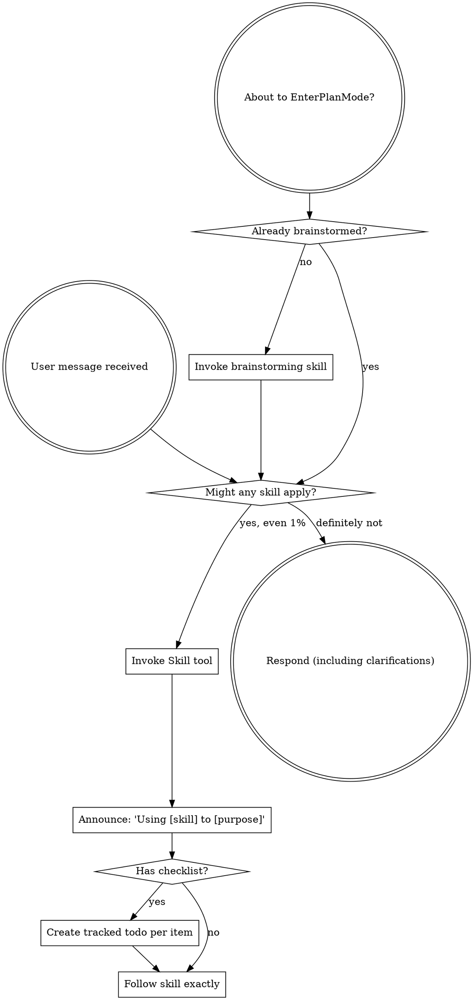

## Jimu Platform Adaptation

This skill was imported from a third-party agent ecosystem. When running in Jimu, do not treat upstream host names or tool names as literal requirements. Map them to Jimu capabilities instead:

- Claude Code, Claude.ai, Copilot CLI, Codex, Gemini CLI, and OpenCode mean the current Jimu agent runtime unless the text is explicitly describing the upstream source.
- Upstream tool names such as `Read`, `Write`, `Edit`, `Bash`, `Task`, `WebFetch`, `Skill`, and `TodoWrite` are not Jimu tool names. Use Jimu file, shell, web/browser, skill, todo, and sub-agent tools where available.
- MCP-specific names such as `microsoft_docs_search`, `microsoft_docs_fetch`, Context7, or Aspire MCP are optional upstream integrations. Use them only if the corresponding MCP is configured in Jimu; otherwise use available web or document retrieval tools.
- Instructions to invoke or dispatch skills/subagents should be interpreted through Jimu's skill and sub-agent mechanisms, not through Claude Code/OpenCode/Copilot-specific APIs.

<SUBAGENT-STOP>
If you were dispatched as a subagent to execute a specific task, skip this skill.
</SUBAGENT-STOP>

<EXTREMELY-IMPORTANT>
If you think there is even a 1% chance a skill might apply to what you are doing, you ABSOLUTELY MUST invoke the skill.

IF A SKILL APPLIES TO YOUR TASK, YOU DO NOT HAVE A CHOICE. YOU MUST USE IT.

This is not negotiable. This is not optional. You cannot rationalize your way out of this.
</EXTREMELY-IMPORTANT>

## Instruction Priority

Superpowers skills override default system prompt behavior, but **user instructions always take precedence**:

1. **User's explicit instructions** (CLAUDE.md, GEMINI.md, AGENTS.md, direct requests) — highest priority
2. **Superpowers skills** — override default system behavior where they conflict
3. **Default system prompt** — lowest priority

If CLAUDE.md, GEMINI.md, or AGENTS.md says "don't use TDD" and a skill says "always use TDD," follow the user's instructions. The user is in control.

## How to Access Skills

**In Jimu:** Use Jimu's skill mechanism. When a skill is active, follow the loaded skill content directly. Do not assume upstream host-specific tool behavior.

**In other hosts:** Treat host-specific skill invocation instructions as upstream references and map them to the current runtime.

**In Gemini CLI:** Skills activate via the `activate_skill` tool. Gemini loads skill metadata at session start and activates the full content on demand.

**In other environments:** Check your platform's documentation for how skills are loaded.

## Platform Adaptation

Some upstream Superpowers skills use host-specific tool names. In Jimu, map those names to Jimu file, shell, web, todo, skill, and sub-agent capabilities; bundled reference mappings are upstream examples only.

# Using Skills

## The Rule

**Invoke relevant or requested skills BEFORE any response or action.** Even a 1% chance a skill might apply means that you should invoke the skill to check. If an invoked skill turns out to be wrong for the situation, you don't need to use it.

## Red Flags

These thoughts mean STOP—you're rationalizing:

| Thought | Reality |
|---------|---------|
| "This is just a simple question" | Questions are tasks. Check for skills. |
| "I need more context first" | Skill check comes BEFORE clarifying questions. |
| "Let me explore the codebase first" | Skills tell you HOW to explore. Check first. |
| "I can check git/files quickly" | Files lack conversation context. Check for skills. |
| "Let me gather information first" | Skills tell you HOW to gather information. |
| "This doesn't need a formal skill" | If a skill exists, use it. |
| "I remember this skill" | Skills evolve. Read current version. |
| "This doesn't count as a task" | Action = task. Check for skills. |
| "The skill is overkill" | Simple things become complex. Use it. |
| "I'll just do this one thing first" | Check BEFORE doing anything. |
| "This feels productive" | Undisciplined action wastes time. Skills prevent this. |
| "I know what that means" | Knowing the concept ≠ using the skill. Invoke it. |

## Skill Priority

When multiple skills could apply, use this order:

1. **Process skills first** (brainstorming, debugging) - these determine HOW to approach the task
2. **Implementation skills second** (frontend-design, mcp-builder) - these guide execution

"Let's build X" → brainstorming first, then implementation skills.
"Fix this bug" → debugging first, then domain-specific skills.

## Skill Types

**Rigid** (TDD, debugging): Follow exactly. Don't adapt away discipline.

**Flexible** (patterns): Adapt principles to context.

The skill itself tells you which.

## User Instructions

Instructions say WHAT, not HOW. "Add X" or "Fix Y" doesn't mean skip workflows.
